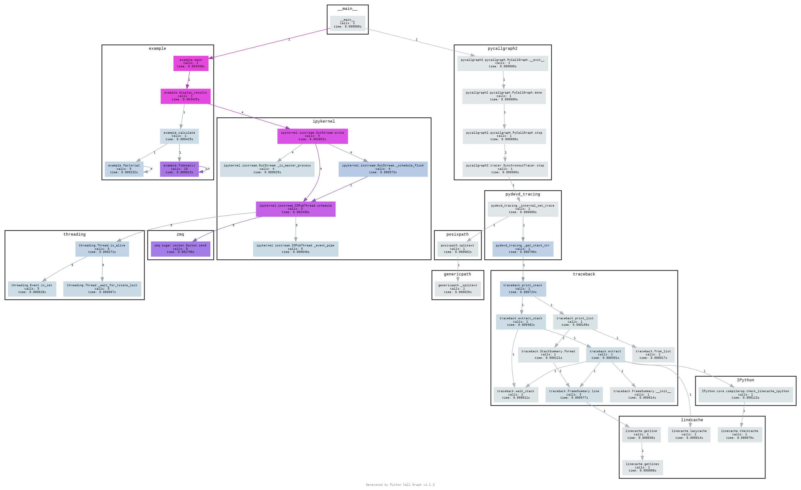
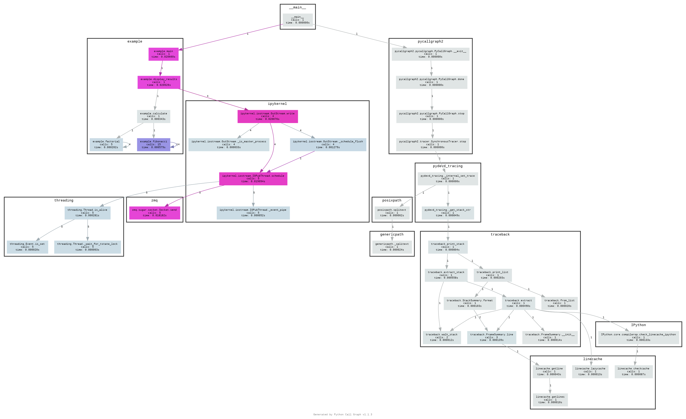
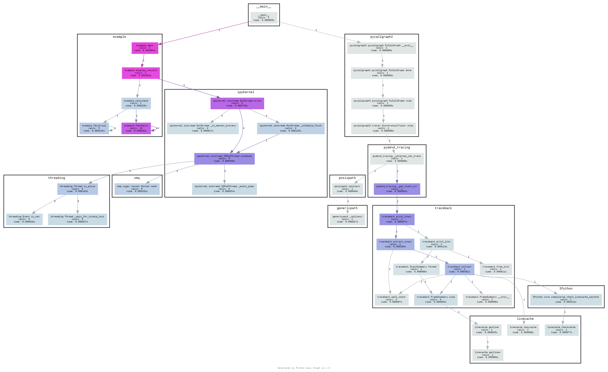

# Python Function Call Graph Generator

Demonstrates how to generate and visualize function call graphs in Python, specifically focusing on a sample script `example.py`. The call graph is generated using the `pycallgraph2` library and visualized using Graphviz.

## Files
- demo_python_function_call_graph_generator.py outputs the following:

	- `example.py`: Python script containing functions such as `factorial`, `fibonacci`, `calculate`, `display_results`, and `main` to demonstrate function calls.
	- `call_graph.dot`: DOT file representing the function call graph.
	- `call_graph.png`: PNG image of the call graph generated from `example.py`.

	- `call_graph_calling_between_functions.png`: PNG image of the call graph showing the functions `main`, `display_results`, `calculate`, `factorial`, and `fibonacci`.

	- `call_graph_calling_between_functions_in_example.py.png`: PNG image of the call graph

